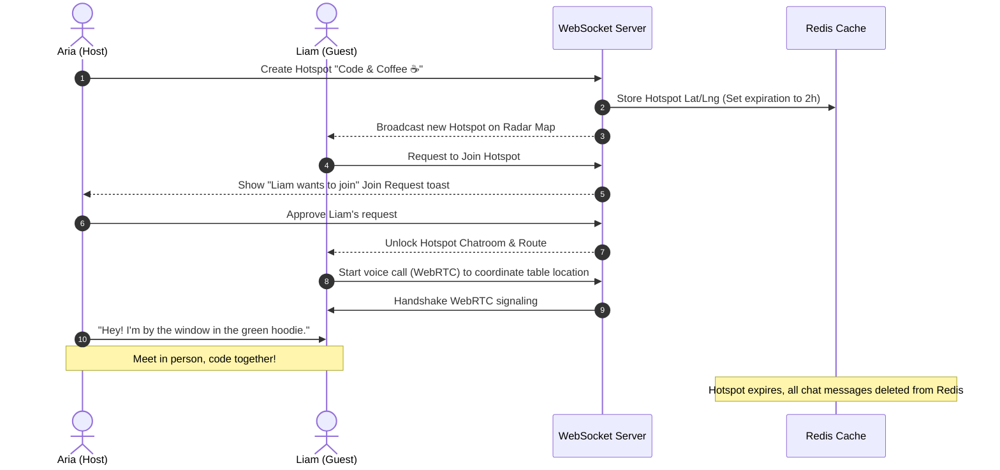
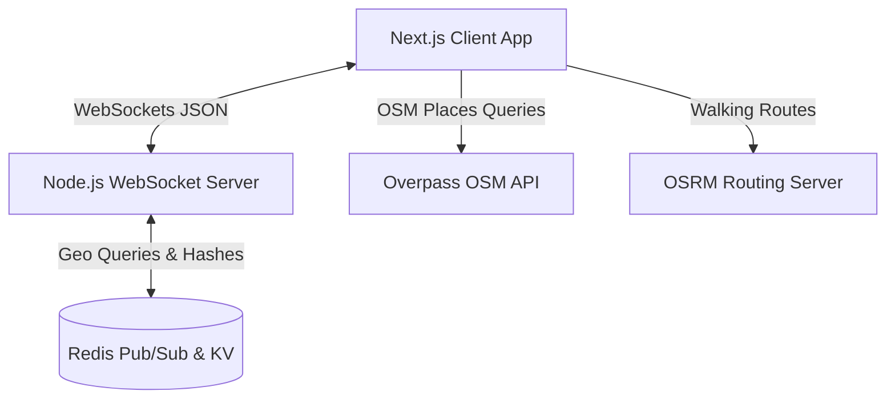

# Norby 🗺️

<p align="center">
  
</p>

<p align="center">
  
  
  
  
  
</p>

> **Stop scrolling. Start meeting. Connect with your neighborhood in real-time.**

Norby is a hyper-local, privacy-first, real-time social discovery platform designed to cure digital isolation by bringing neighborhoods together through ephemeral coordination. 

---

## ☕ The Core Purpose: Curing Solitude in Real-Time

Existing social networks connect us to the *world* but disconnect us from our *immediate surroundings*. Norby bridges the gap by focusing purely on physical proximity and real-world meetups. 

Imagine sitting at a local coffee shop wanting to play chess, study, or grab a drink, but none of your contacts are free. Instead of scrolling social feeds, you open **Norby**:
1. You see other active neighbors on your live radar.
2. You drop a **Hotspot Room** at your location (e.g., *“Chess & Coffee ☕”*).
3. Nearby users see your hotspot, request to join, and chat to coordinate.
4. Within minutes, you meet up in person. An hour later, the chat history vanishes completely.

---

## ✨ Key Features

### 📍 Hyper-Local Live Map
* **Interactive Radar**: Integrates React Leaflet for interactive map rendering. Shows nearby users and group hotspots within your custom radar range (e.g., 5km to 25km).
* **Vibe Emojis & Custom Profiles**: Choose an avatar, write a short bio, pick interest tags (e.g. `coding`, `music`, `coffee`), and set a dynamic vibe emoji that displays directly on your map pin.

### 🔥 Ephemeral Hotspots (Group Spaces)
* **Join Requests & Host Moderation**: Hotspots are private by default. Strangers request access, and the host approves or declines them.
* **Transient Chatrooms**: Secure coordinates chatroom automatically created for members. All messages vanish 1 hour after transmission.
* **Walk Navigation Routing**: Calculates walking/driving distance, ETA, and draws an interactive route line on the map using OpenStreetMap routing engines.
* **Physical Meetup Safety & SOS**: Provides safety checklists and a one-tap GPS SOS share button to send your live coordinates to trusted contacts when meeting in person.

### 🎙️ WebRTC Voice Call Infrastructure
* **1-to-1 Calls**: Low-latency peer-to-peer voice calling directly inside direct messages. Includes ringtone audio and clean floating caller widgets.
* **Live Audio Spaces**: Hosts can start spatial audio broadcasts in Hotspot Rooms. Participants can request to speak, and hosts can manage speaking permissions in real time.

### 🐝 Bee: The Resident AI Guide
* **Smart Guide**: Bee (`bee_ai_bot`) is a witty, sarcastic Gen-Z AI companion powered by `openai/gpt-4o-mini` via Puter AI.
* **Gated Map Awareness**: Bee has access to coordinates, nearby active hotspots, and active users. She is strictly gated to *only* share this information if you explicitly ask, keeping normal chat bubbles natural.
* **On-Demand Image Generation**: Generates images from Unsplash or avatars from Dicebear using clean markdown formatting when asked.

### 🛡️ Privacy-First Engineering
* **Stable Grid Offset Masking**: Protects exact locations by deterministic shifting. It keeps your house number hidden in a 500m cell size while rendering a stable pin.
* **GPS Battery-Saver Stasis Loop**: Suspends active GPS polling if you stay in the same place for 3 minutes, saving battery life. Instantly wakes up on map interaction or physical movement.

---

## 🗺️ Real-World Walkthrough

Let's trace how two neighbors, **Aria** and **Liam**, connect for a coding session:



---

## 🏗️ System Architecture

Norby utilizes a decoupled frontend client, a standalone WebSocket signaling server, and a high-performance Redis cache layer.



### 1. Database Schema (Redis Keys)
* `norby:user_locations` (Sorted Set / Geohash): Holds geolocation indices of all active users.
* `norby:active_users` (Hash): Stores serialized user profiles mapped by `user_id`.
* `norby:hotspots` (Hash): Stores active hotspot properties, host details, and guest rosters.

### 2. Throttled Signaling Protocol
To prevent UI lagging and server hammering, the server schedules coordinate broadcasts at a static **3-second cycle**. Location updates are stored immediately in Redis, and batch frames are sent down to active connections.

---

## 🚀 Getting Started

### Prerequisites
* **Node.js** (v18 or higher)
* **Redis** (local instance or cloud Redis server)

### 1. Setup Environment
Clone the repository and install dependencies:
```bash
git clone https://github.com/gitsofaryan/norby.git
cd norby
npm install
```

Create a `.env.local` file in the root directory:
```env
NEXT_PUBLIC_WS_URL=ws://localhost:3001
REDIS_URL=redis://localhost:6379
```

### 2. Launch Services
Start the Next.js frontend and the WebSocket backend concurrently:
```bash
npm run dev
```

* **Frontend Dashboard**: [http://localhost:3000](http://localhost:3000)
* **WebSocket Server**: Running on port `3001`

### 3. Running Test Suites
Norby uses Vitest for unit and integration testing:
```bash
npm run test:run
```

---

## 🤝 Contributing & Bounty Program

We welcome contributions from the developer community! 

> [!TIP]
> ### 🎁 Pull Request Bounties
> Pull requests that fix high-impact bugs, improve geolocation caching, or add voice filtering are eligible for rewards up to **₹250** per merged PR. Read [CONTRIBUTING.md](CONTRIBUTING.md) for full guidelines.
